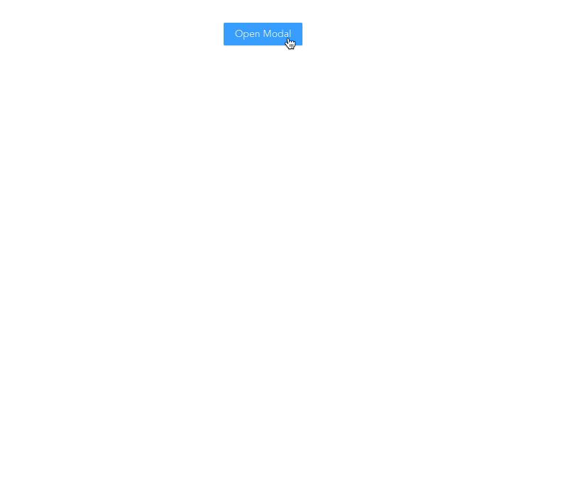

<p align="center">
  
  <p align="center">在Vue应用里, 让你的容器可以跳起来！</p>
  <p align="center">
    
    
    
  </p>
</p>





## 安装
确保 Vue 版本 >= 3.x

```bash
npm i v-drag-move -S
# or
yarn v-drag-move
```


## Demo
[Click Try](https://codesandbox.io/s/loving-cdn-d30m5?file=/src/App.vue)

```vue
<template>
  <DragMove
    move-selector=".container"
    drag-selector=".container .header"
  >
    <div class="container">
      <header class="header"></header>
    </div>
  </DragMove>
</template>

<script lang="ts">
import { defineComponent } from 'vue'
import DragMove from 'v-drag-move'

export default defineComponent({
  name: 'App',
  components: {
    DragMove
  }
})
</script>

<style>
.container {
  width: 300px;
  height: 500px;
  margin: 0 auto;
  border: 1px solid red;
  border-radius: 5px;
}

.header {
  height: 35px;
  border-bottom: 1px solid #ccc;
}
</style>
```


## Attributes
| 参数           | 描述              |类型           | 默认值              |是否必填   |
| ------------- |------------------- |-------------- |------ |
| active | 是否处于激活状态, 对于类似 Modal 组件务必设置 | boolean | false |否 |
| move-selector | 容器选择器, 整个容器能被移动 |  string  | -- |是 |
| drag-selector | 拖动选择器, 拖动部位, 默认容器部位 |string| -- |否 |


## LICENSE
[MIT](./LICENSE)
